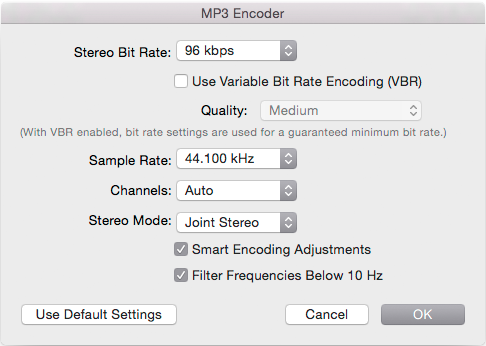

Create Your MP3 File
=======

Once your audio is complete, the first step to publishing is to encode it to an MP3 file.

## TLDR

Don't care about the details? Use [**iTunes**](http://www.apple.com/itunes/download/), with these settings.

## Choosing the encoder

The two popular MP3 encoders are (1) a commercial MP3 encoder made by **Fraunhofer** (the inventor of the MP3 format), and (2) the open source **LAME** encoder.

At typical podcast bitrates (64 and 96 kbps), the Fraunhofer encoder has a slight quality edge on LAME.  So encode using the Fraunhofer encoder if possible.

Commercial software like iTunes and Adobe Audition generally use the Fraunhofer encoder.  Open source software can often use the LAME encoder, although it typically needs to be installed separately.

## Bitrate

**96 kbps** is the best balance between quality and file size.

People using LibSyn and other hosts that charge based on "monthly storage" often encode at 64 kbps to meet that limitation.

## Mono or stereo?

Trick question!  Neither.  Use "**Joint Stereo**" (JS) encoding.

The great thing about "joint stereo" encoding is that it gives you the best of both worlds — mono content encodes as efficiently as a forced-mono encode, but stereo content is still reproduced (very efficiently) in glorious stereo.

JS encoding (as compared to mono) is better for your show's music, and allows you to place hosts and guests at slightly different spots on a stereo soundstage to improve the clarity and interest of your podcast.

